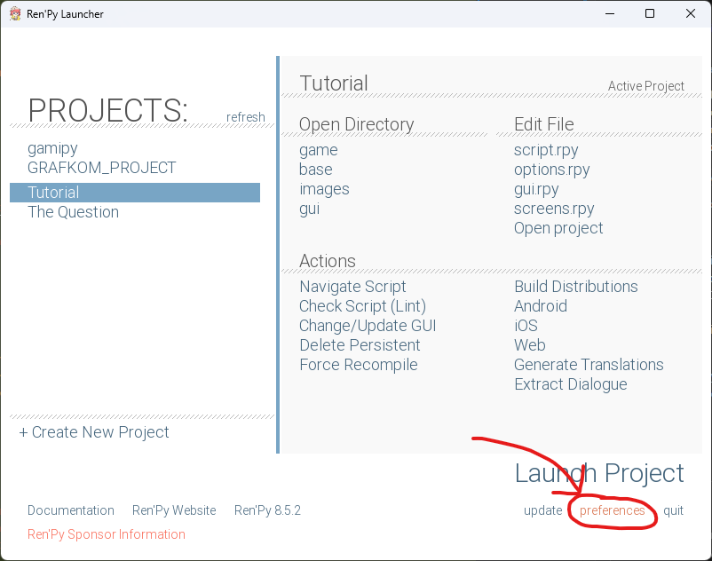
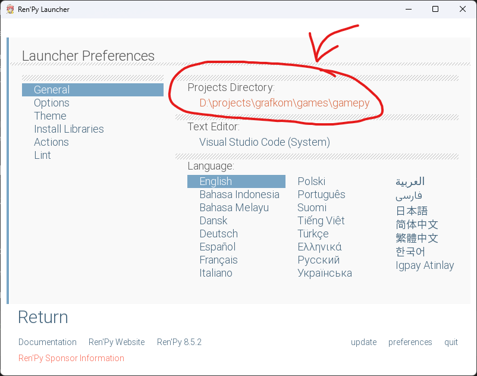
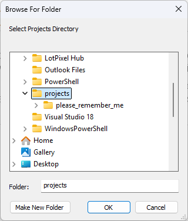
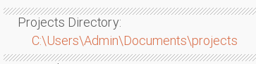
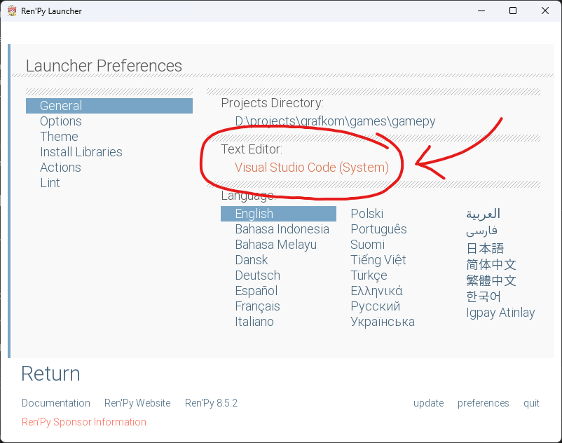
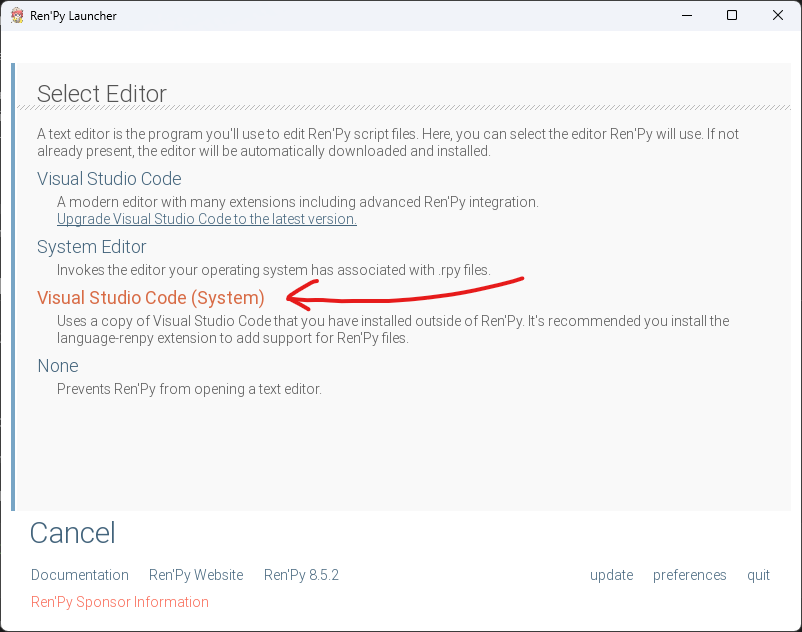
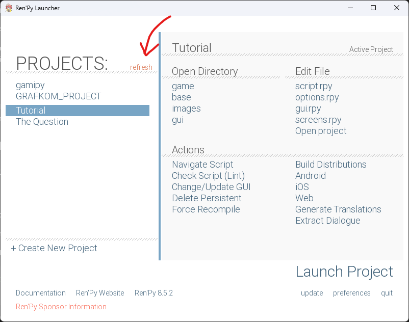

# please_remember_me (Ren'Py)

Project ini adalah game visual novel berbasis Ren'Py. Dokumentasi ini menjelaskan kebutuhan awal, alur development, cara menjalankan, dan cara build untuk multi-platform (Windows, macOS, Linux).

## Ringkasan struktur project

- Script utama game: [game/script.rpy](game/script.rpy)
- Konfigurasi dan metadata project (nama game, versi, build/archive): [game/options.rpy](game/options.rpy)
- UI dan komponen layar:
  - [game/screens.rpy](game/screens.rpy)
  - [game/gui.rpy](game/gui.rpy)
- Asset umum:
  - Audio: [game/audio](game/audio)
  - Gambar (background/character/dll): [game/images](game/images)
  - Aset GUI: [game/gui](game/gui)

## Prerequisite

Sebelum mulai development atau menjalankan game, pastikan tools di bawah sudah terinstall:

1. Git
   - Wajib kalau project diambil dari GitHub (git clone)
2. Ren'Py SDK
   - Download: https://www.renpy.org/latest.html
3. Text editor / IDE
   - Visual Studio Code direkomendasikan untuk edit file .rpy.

## Setup pertama kali (semua platform)

Urutan yang paling nyaman (disarankan): install Ren'Py dulu, lalu clone repo. Alasannya: setelah clone, kamu bisa langsung cek project sudah terbaca oleh launcher.

### 1) Install Ren'Py SDK

1. Download Ren'Py SDK lalu install/extract.
2. Jalankan Ren'Py Launcher.

### 2) Clone repository (GitHub)

Ren'Py mendeteksi project berdasarkan “Projects Directory” (folder yang berisi kumpulan folder project). Agar project mudah terdeteksi, gunakan pola ini:

- Projects Directory: `Documents/projects`
- Folder project (hasil clone): `Documents/projects/please_remember_me`

Windows (PowerShell):

```powershell
New-Item -ItemType Directory -Force "$env:USERPROFILE\Documents\projects" | Out-Null
Set-Location "$env:USERPROFILE\Documents\projects"

# Ganti URL di bawah dengan URL repo GitHub kamu
git clone https://github.com/Ijaaxx/please_remember_me.git please_remember_me

```

macOS/Linux (Terminal):

```bash
mkdir -p "$HOME/Documents/projects"
cd "$HOME/Documents/projects"

# Ganti URL di bawah dengan URL repo GitHub kamu
git clone https://github.com/Ijaaxx/please_remember_me.git please_remember_me
```

Catatan:

- “Folder project” adalah folder yang langsung berisi folder [game](game) (misalnya `please_remember_me/game`).
- Kalau kamu sudah terlanjur menaruh repo lebih dalam (misalnya `Documents/projects/please_remember_me/isi_project`), Ren'Py bisa saja tidak mendeteksinya tergantung versi/konfigurasi. Paling aman: pastikan folder project menjadi anak langsung dari Projects Directory.

### 3) Set Projects Directory dan Text Editor di Ren'Py Launcher

1. Dari Ren'Py Launcher, klik **preferences**.



2. Di tab **General**, set **Projects Directory** ke folder yang berisi kumpulan project.

- Jika project kamu berada di `Documents/projects/please_remember_me`, maka Projects Directory harus `Documents/projects`.





3. Masih di tab **General**, pada **Text Editor** klik lalu pilih **Visual Studio Code (System)** agar Ren'Py membuka VS Code yang sudah terinstall untuk edit .rpy.




4. Klik **Return** untuk kembali ke menu utama.
5. Jika project belum muncul di daftar kiri, klik **refresh**.



6. Setelah project muncul, pilih project lalu klik **Launch Project**.

## Development workflow

### Edit script

- Semua script Ren'Py ada di folder [game](game).
- Untuk mengerjakan story/logic utama, fokus di [game/script.rpy](game/script.rpy).
- Jika ingin menambah fitur besar, pertimbangkan membuat file .rpy baru di folder [game](game) (agar perubahan lebih terisolasi), lalu panggil dari script utama.

### Menjalankan saat development

Cara paling aman adalah lewat Ren'Py Launcher:

1. Buka Ren'Py Launcher.
2. Pilih project ini.
3. Klik “Launch Project” untuk menjalankan.

Tips:

- Jika ada error, Ren'Py biasanya menampilkan file dan lokasi error. Simpan salinan pesan error (bisa juga ditaruh di [errors.txt](errors.txt) atau [traceback.txt](traceback.txt)).
- Jika perubahan membuat game tidak bisa jalan, rollback dengan backup.

## Menjalankan program (Running)

### Opsi 1: Melalui Ren'Py Launcher (disarankan)

- Pilih project di launcher lalu “Launch Project”.

### Opsi 2: Melalui command line (untuk pengguna advanced)

Lokasi executable Ren'Py berbeda per OS. Prinsipnya, jalankan Ren'Py dengan target directory project.

Windows (contoh pola umum):

```powershell
# Jalankan dari folder Ren'Py SDK
./renpy.exe "$env:USERPROFILE\Documents\projects\please_remember_me"
```

macOS (contoh pola umum):

```bash
# Jalankan dari folder Ren'Py SDK
./renpy.sh "$HOME/Documents/projects/please_remember_me"
```

Linux (contoh pola umum):

```bash
# Jalankan dari folder Ren'Py SDK
./renpy.sh "$HOME/Documents/projects/please_remember_me"
```

Catatan:

- Nama file launcher Ren'Py bisa berbeda tergantung paket SDK yang diunduh. Kalau ragu, gunakan Ren'Py Launcher (GUI).

## Build / Distribute (Multi-platform)

Ren'Py mendukung pembuatan distribusi untuk beberapa platform dari satu mesin (tergantung toolchain yang tersedia). Cara paling mudah:

1. Buka Ren'Py Launcher.
2. Pilih project.
3. Pilih menu “Build Distributions”.
4. Pilih target platform yang dibutuhkan (misalnya Windows/macOS/Linux) lalu mulai build.

Output hasil build akan berada di folder distribusi yang dibuat Ren'Py (lokasinya ditampilkan oleh launcher).

## Credits (Asset)

Beberapa asset yang digunakan dalam project ini berasal dari sumber berikut:

- Character (chara): https://xiael.itch.io/tia-sprite
- Background (bg):
  - https://vanilleblooms.itch.io/cozy-cottage-asset-pack
  - https://connil-de-la-mienuit.itch.io/slightly-spooky-forests-assets

## Troubleshooting

### Error script saat start

- Jika muncul pesan seperti pada [errors.txt](errors.txt) (contoh: “if statement expects a non-empty block”), artinya ada kesalahan sintaks atau blok kosong pada script.
- Langkah cepat:
  - Buka file yang disebut error (misalnya [game/script.rpy](game/script.rpy)).
  - Periksa bagian yang ditunjuk oleh Ren'Py (biasanya sekitar baris yang ditampilkan).
  - Jalankan ulang lewat launcher setelah perbaikan.

### Assets tidak muncul / audio tidak jalan

- Pastikan path aset sesuai dengan lokasi file di [game/audio](game/audio) dan [game/images](game/images).
- Pastikan penamaan file (huruf besar/kecil) konsisten, terutama untuk macOS/Linux yang case-sensitive.

## FAQ singkat

### Apakah perlu install Python terpisah?

Biasanya tidak perlu. Ren'Py SDK sudah ada Python runtime sendiri.

### Di mana saya mengubah cerita?

Mayoritas ada di [game/script.rpy](game/script.rpy).
